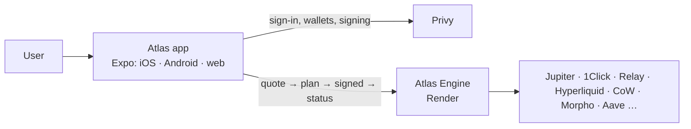

# Atlas

**Your money, one balance, anything on-chain.** Atlas is a money app for people whose salary loses value
while it sits in the bank, Nigerians first. Add naira-worth of dollars once, then buy memes, tokenized
stocks and crypto, open perps, earn yield and pay friends, all from one balance shown in your own currency,
with **one tap to confirm** and no chain names, bridges or gas to think about.

- **Engine (API):** [Iwetan77/Atlas-Engine](https://github.com/Iwetan77/Atlas-Engine), live at
  https://atlas-engine-djed.onrender.com
- **This repo:** the client. React Native + Expo (managed workflow), TypeScript, one codebase for iOS,
  Android and web.

Money is always shown in the user's currency (₦, $, €, £, KSh, GH₵, R). Under the hood it's USDC on Solana
and Base; chain names only appear on the deposit screen, where sending on the wrong network loses money.

---

## How it works

1. **Sign in** with Google or email. Privy creates the user's own wallets (EVM and Solana) with no seed
   phrase and no "create wallet" step.
2. **Add money** from the Add money sheet:
   - **Wallet or exchange:** USDC on Solana or Base goes straight in; USDT on Tron or BNB Chain, USDC on Sui,
     SOL and 19 more networks and coins get a one-off address (with a QR and live status) and arrive as dollars.
     Each option shows its coin's logo with the chain as a badge.
   - **Bank transfer** and **virtual account:** coming (Daya).
3. **Home** shows the one balance (hide it with the eye: amounts turn into `₦••••`), what's earning, and a
   card per coin held with its gain or loss, shareable as an image.
4. **Trade:** Trending (the day's biggest risers, per kind), Crypto, Stocks and Memes, plus search by name or
   pasted address on any supported chain. Every asset has a price chart; a coin nobody has vetted carries an
   **unverified** warning with its address.
5. **Buy or sell in one tap.** The app gets a live quote (price held for a few seconds, refreshed), the user
   confirms once on the confirm sheet, and the app signs the engine's plan and follows it to the end:
   "Getting your money ready…", then "Buying…", then done. If the cash is on another chain, it moves first,
   inside that same confirm.
6. **Perps** on Hyperliquid: crypto, stocks, commodities, indices and currencies, long or short with leverage,
   margin from the balance, liquidation price shown before opening, one tap to close, and the money comes back
   to the balance.
7. **Earn:** pick a venue (Jupiter Lend, Morpho, Aave, Jito), then what to save in, best rate first; put in or
   take out any time.
8. **Send** to an @handle, straight to the friend's wallet on the chain the cash is on. Bank payouts (Daya)
   and Atlas Links anyone can claim are built in the app and switch on when the engine's side is configured.
9. **Errors speak money:** "Not enough in your balance for this. You have ₦12,400 to spend", with an
   **Add money** button right there.

---

## What's integrated

| | What it does in the app |
|---|---|
| **Expo SDK 57 + Expo Router** | One codebase for iOS, Android and web; file-based routes in `src/app`. |
| **Privy (Expo and React SDKs)** | Google and email sign-in, the user's embedded wallets, headless signing after the one confirm. |
| **Atlas Engine** | Everything with money in it: balance, quotes, plans, deposits, perps, earn, friends. The app sends the Privy access token on every request. |
| **react-native-qrcode-styled** | Deposit QR codes. |
| **EAS** | Cloud builds (APK / iOS) and updates. |

---

## Safety model

- **The app never holds keys or secrets.** Wallets are Privy's embedded wallets, owned by the user; the Privy
  app secret lives only in the engine.
- **One confirm, then only what was confirmed.** The confirm sheet shows the plan in plain words; the app
  signs exactly the engine's plan (plain transactions only, never typed data) and nothing else.
- **No wallet pop-ups.** Privy's own UIs are off, so the confirm sheet is the only prompt the user answers.
- **Base transactions are relayed, not re-built:** the app hands the planned transaction to the engine,
  which sends it only if it matches the plan byte for byte.
- **Gas is the user's own**, topped up from their USDC when needed; the app never asks Privy to sponsor it.
- **Unverified coins say so**, with the address, before any money moves.

---

## Architecture



```
src/app            Screens (Expo Router): tabs (Home, Trade, Perps, Send, More), trade/[assetId],
                   perps/[marketId], earn, deposit, send/*, profile, sign-in, claim/[linkId]
src/api            Engine client and the typed contract (contract.ts); intents.ts runs every action
src/signing        Confirm sheet, signers (native and web), chain helpers
src/auth           Privy provider (native and web), session state
src/funding        The Add money sheet
src/components     Home cards, trade, perps, send, share cards, UI kit (SelectSheet, PillButton…)
src/format         Money, currency list and flags
```

**Every action in one breath:** `getPlan()` (quote → execute) → the confirm sheet → sign or send each
transaction → `POST /v1/intents/{id}/signed` → poll `GET /v1/intents/{id}`; when the engine says the second
step is ready (cash or gas landed), `GET /next`, sign, report, and keep polling until filled or failed
(`src/api/intents.ts`).

---

## Run it locally

You need Node 22+ (the app is built with Node 25).

```bash
npm install
cp .env.example .env        # EXPO_PUBLIC_ENGINE_URL (and optionally EXPO_PUBLIC_PRIVY_CLIENT_ID)
npx expo start              # web, or a development build on a phone
npx expo export -p web      # static web build in dist/
```

The app uses native modules beyond Expo Go, so on a phone use a development build
(`npx eas-cli@latest build --profile development`) and `npx expo start`.

Before every commit:

```bash
npx tsc --noEmit
npx expo lint
```

## Build

```bash
npx eas-cli@latest build -p android --profile preview      # installable APK
npx eas-cli@latest build -p ios --profile preview          # needs an Apple Developer account
```

Every profile in `eas.json` points at the live engine (`EXPO_PUBLIC_ENGINE_URL`). Mainnet only.

---

## What's been verified

| Check | Status |
|---|---|
| Sign-in, wallets, balance and holdings against the live engine | ✅ web and phone |
| Trade lists, search, charts, quotes and the unverified warning | ✅ live engine |
| Confirm sheet → sign → settle, two-step plans (cash or gas first), stalls and retries | ✅ against a stand-in engine that follows `contract.ts` |
| Deposit list (featured + More networks and coins), QR and status, Back to the Add money list | ✅ web |
| Earn venues and markets (incl. Morpho's vaults), hidden balance, currency picker | ✅ web |
| Funded mainnet flows: buy, sell, send, earn, perps, deposits | ⏳ needs a funded wallet |


## Desktop website and phone installation

Laptop/desktop browsers (at least 1024px wide, excluding iPhone/iPad/Android user agents) use an Atlas pink/slate website: public welcome and Google/email sign-in, sidebar navigation, a two-column Home dashboard, asset cards, market/order panels, Send/More grids and centred approval/funding dialogs. These reuse the same real account, balance, quotes, history and signing flows. Native and narrow mobile web retain the phone layout; mobile web adds a small installation link. Private browser session/wallet components mount after hydration so a server snapshot cannot reset sign-in.

`/install` is public. iPhone shows original Atlas illustrations and Safari Share -> Add to Home Screen instructions. It installs the website as a web app, not an iOS native binary. The public web manifest and existing Atlas icon provide the standalone name/icon. No service worker caches balances, login tokens or signed requests.

Android says **Coming soon** until `EXPO_PUBLIC_ANDROID_APK_URL` is a public HTTPS URL to the published APK. This value is intentionally public. Add it to the web build environment and rebuild when the APK exists; do not put secrets in `EXPO_PUBLIC_` variables. Desktop's Get Atlas link opens the same platform guide. The install strip hides in standalone mode.

Build/check: `npx tsc --noEmit`, `npx expo lint`, `npx expo export -p web`, `git diff --check`. The production website is served by the engine at `https://atlas-engine-djed.onrender.com`; set both `EXPO_PUBLIC_ENGINE_URL` and `EXPO_PUBLIC_WEB_URL` to that origin for the web export. Copy the production export into the engine's `crates/engine-service/web/` for Render (never copy local QA fixtures). When hosting at a new domain, allow that exact origin in the engine's `ATLAS_ALLOWED_ORIGINS` and in Privy's allowed web origins; the backend URL is public but authentication remains required. There is no test auth bypass in this implementation.

### Current Android download
Atlas Android **1.0.1 (build 2)** is published at [Download Atlas](https://github.com/Iwetan77/Atlas/releases/download/v1.0.1-beta.2/atlas-1.0.1.apk).
The website's Android download button uses this release by default; EXPO_PUBLIC_ANDROID_APK_URL can override it.
The APK was built from a7295dc with the preview profile and the existing signing credentials.
